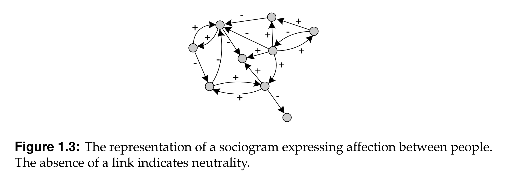
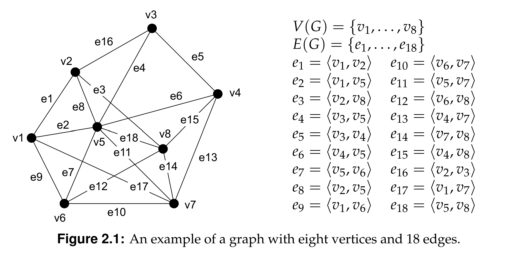
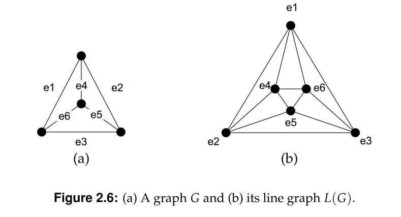
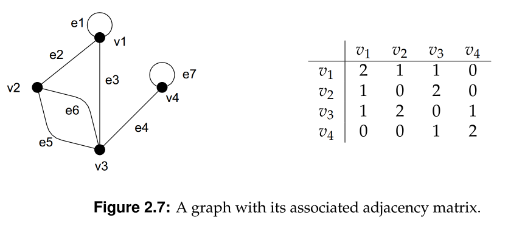
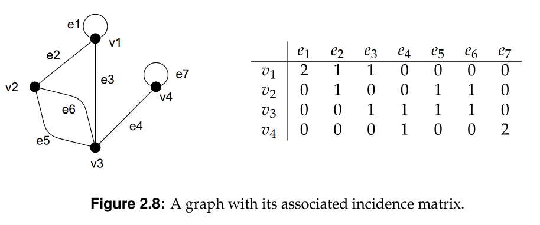
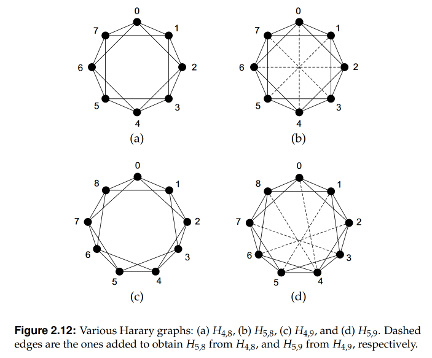
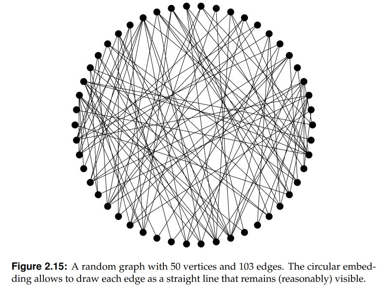
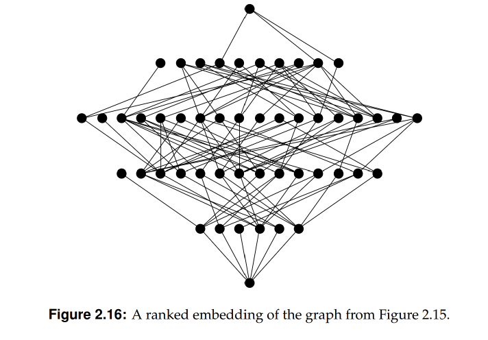

# Graph Theory and Complex Networks: An Introduction

**TABLE OF CONTENTS**:

1. [Introduction](#chapter-1-introduction)
    - 1.1 [Communication networks](#11-communication-networks)
    - 1.2 [Social networks](#12-social-networks)
2. [Foundations](#chapter-2-foundations)
    - 2.1 [Formalities](#21-formalities)
    - 2.2 [Graph representations](#22-graph-representations)
    - 2.3 [Connectivity](#23-connectivity)
    - 2.4 [Drawing graphs](#24-drawing-graphs)

---

## Chapter 1: Introduction

**Complex Network** (informal definition): "large collection of interconnected nodes".
- "Generally so huge that it is impossible to understand or predict their overall behavior by looking into the behavior of individual nodes or links".

### 1.1 Communication networks

**Trees** (informal definition): networks in which, between any two nodes, messages could travel only through a unique path.

**Packet switching** *vs* **circuit switching**:
- <u>Packet switching</u>: When a switch (or node) receives a packet, it only decides to which next switch to forward the packet.
- <u>Circuit switching</u>: Firstly, two endpoints establish a path and then let all communication pass through such path.

### 1.2 Social Networks

**Small world** (informal definition): "two people can reach each other through a chainof just a handful of messages".

**Sociograms**:
- Introduced by Jacob Moreno in the 1930s.
- Graphical representation of a network: people are represented by dots or vertices, their relationships by lines connecting the dots (edges).

  

## Chapter 2: Foundations

### 2.1 Formalities

<u>**Definition 2.1**</u>: A <u>graph</u> $G$ consists of a collection $V$ of <u>vertices</u> and a collection $E$ of <u>edges</u>, which we write $G = (V,E)$. Each edge $e \in E$ is said to join two vertices, which are called its <u>end points</u>. If $e$ joins $u,v \in V$, we write $e = \langle u,v \rangle$. Vertices $u$ and $v$ are said to be <u>adjacent</u>. Edge $e$ is said to be <u>incident</u> with vertices $u$ and $v$, respectively.

**Special cases**:
- **Simple graphs**: do not have loops (an edge linking a node to itself) or multiple edges between two nodes.
- **Empty graph**: trivial graph, with no nodes and consequently no edges.
-  **Complete graph** (denoted $K_n$): a simple graph with $n$ nodes, with each node being connected to all other nodes.
- **Complement of a graph** $G$ (denoted $\overline G$): obtained from $G$ by removing all its edges and joining the vertices that were *not* adjacent.

<u>**Definition 2.2**</u>: For any graph $G$ and vertex $v \in V(G)$, the <u>neighbor set</u> $N(v)$ is the set of vertices (other than $v$) adjacent to $v$, that is:

$$
N(v) \stackrel{\text{def}}{=} \{ w \in V(G)\ |\ v \neq w, \exists\ e \in E(G) : e = \langle u,v \rangle \}.
$$

  

**Degree of a vertex**: number of edges that are incident with it.

<u>**Definition 2.3**</u>: The number of edges incident with a vertex $v$ is called the *degree* of $v$, denoted as $\delta (v)$. Loops are counted twice.

<u>**Theorem 2.1**</u>: For all graphs $G$, the sum of vertex degrees is twice the number of edges, that is:

$$
\displaystyle\sum_{v \in V(G)} \delta(v) = 2 \cdot |E(G)|.
$$

<u>**Proof**</u>: When we count the edges of a graph G by enumerating for each vertex v of G the edges incident with that vertex v, we are counting each edge exactly twice.

<u>**Corollary 2.1**</u>: For any graph, the number of vertices with odd degree is even.
- Let us split all vertices into two sets ($V_\text{odd}$ and $V_\text{even}$), based on whether the vertices have odd or even degree.
- We know that
    - $\sum_{v \in V} \delta(v)$ is even (Theorem 2.1);
    - $\sum_{v \in V} \delta(v) = \sum_{v \in V_\text{odd}} \delta(v) + \sum_{v \in V_\text{even}} \delta(v)$;
    - $\sum_{v \in V_\text{even}} \delta(v)$ is even;
- Thus, $\sum_{v \in V_\text{odd}} \delta(v)$ must add up to an even number, which means that the number of nodes with odd degree is even.

**Degree sequence**: list of degrees of all vertices in a graph.
- If every vertex in a graph has the same degree, the graph is called *regular*.
- A $k$-regular graph is one in which all vertices have degree $k$. Cubic graphs are a special case in which $k=3$.

<u>**Theorem 2.2**</u> ([Havel-Hakimi](https://en.wikipedia.org/wiki/Havel%E2%80%93Hakimi_algorithm)): Consider a list $\mathbf{s} = [d_1, d_2, ..., d_n]$ of $n$ numbers in descending order. This list is graphic if and only if $\mathbf{s}^{\ast} = [d^\ast_1, d^\ast_2, ..., d^\ast_{n-1}]$ of $n-1$ numbers is graphic as well, where:

$$
d^\ast_{i} = \begin{cases}
    d_{i+1} - 1, & \text{for } i=1,2, ..., d_1 \\
    d_{i+1}, & \text{otherwise}
\end{cases}
$$

<u>**Definition 2.4**</u>: A graph $H$ is a *subgraph* of $G$ if $V(H) \subseteq V(G)$ and $E(H) \subseteq E(G)$ such that for all $e \in E(H)$ with $e = \langle u,v \rangle$, we have that $u,v \in V(H)$. When $H$ is a subgraph of $G$, we write $H \subseteq G$.

<u>**Definition 2.5**</u>: Consider a graph $G$ and a subset $V^\ast \subseteq V(G)$. The *subgraph induced by* $V^\ast$ has vertex set $V^\ast$ and edge set $E^\ast$ defined by:

$$
E^\ast \stackrel{\text{def}}{=} \{ e \in E(G) \mid e = \langle u, v \rangle \text{ with } u,v \in V^\ast \}
$$

Likewise, if $E^\ast \subseteq E(G)$, the subgraph induced by $E^\ast$ has edge set $E^\ast$ and vertex set $V^\ast$ defined by: 

$$
V^\ast \stackrel{\text{def}}{=} \{ u,v \in V(G)\ |\ \exists\ e \in E^\ast : e = \langle u,v \rangle \}
$$

The subgraph induced by $V^\ast$ or $E^\ast$ is written as $G[V^\ast]$ or $G[E^\ast]$, respectively.

- Every graph $G = (V, E)$ having $n$ vertices can be seen as a subgraph of the complete graph $K_n$.
- Considering the complement $\overline G = (V, \overline E)$, then the *union* $G \cup \overline G$ (the graph with vertex set $V$ and edge set $E \cup \overline E$) corresponds to $K_n$.

<u>**Definition 2.6**</u>: Consider a simple graph $G=(V,E)$. The *line graph* of $G$, denoted as $L(G)$ is constructed from $G$ by representing each edge $e = \langle u,v \rangle$ from $E$ by a vertex $v_{e}$ in $L(G)$, and joining two vertices $v_{e}$ and $v_{e^\ast}$ if and only if edges $e$ and $e^\ast$ are incident with the same vertex in $G$.

  

**Special induced graphs**
- $G - v$ or $G[V(G) \backslash \{v\}]$: induced subgraph generated by removing vertex $v$.
- $G - e$ or $G[E(G) \backslash \{e\}]$: induced subgraph generated by removing edge $e$.

### 2.2 Graph representations

  

**Adjacency matrix**
- Consider a graph $G$ with $n$ vertices and $m$ edges.
- Its adjacency matrix $A$ is a table with $n$ rows and $n$ columns (square matrix), so that each entry $\mathbf{A}[i,j]$ denotes the number of edges joining vertices $v_i$ to $v_j$.
- Properties:
    - An adjacency matrix is *symmetric*, that is, for all $i,j$, $\mathbf{A}[i,j] = \mathbf{A}[j,i]$. (This is a consequence of representing edges as unordered pairs of vertices: $e = \langle v_i, v_j \rangle = \langle v_j, v_i \rangle$.)
    - A graph $G$ is simple if and only if for all $i,j$ $\mathbf{A}[i,j] \leq 1, i\neq j$ and $\mathbf{A}[i,i] = 0$ (there is at most one edge joining $v_i$ and $v_j$ and no loops).
    - $\delta(v_i) = \sum^{n}_{j=1} = \mathbf{A}[i,j]$, that is, the sum of row $i$ is equal to the degree of vertex $v_i$.

  

**Incidence matrix**
- The incidence matrix of a graph $G$ has $n$ rows and $m$ columns (non-square), so that $\mathbf{M}[i,j]$ contains the number of times ($0$, $1$ or $2$) that edge $e_j$ is incident with vertex $v_i$.
- Properties:
    - $G$ has no loops if and only if for all $i,j$ $\mathbf{M}[i,j] \leq 1$.
    - $\forall i: \delta(v_i) = \sum^{m}_{j=1} = \mathbf{M}[i,j]$, that is, the sum of row $i$ is equal to the degree of vertex $v_i$.
    - Since every edge connects two (not necessarily distinct) endpoints, then $\forall j: \sum^{n}_{i=1} \mathbf{M}[i,j] = 2$.

**Edge list**
- More efficient representation in terms of storage.
- It is a list of edges of graph $G$, specifying for each edge which vertices it is incident with.
- Example: $\big( \langle v_1, v_1 \rangle, \langle v_1, v_2 \rangle, \langle v_1, v_3 \rangle, \langle v_2, v_3 \rangle, \langle v_2, v_3 \rangle, \langle v_3, v_4 \rangle, \langle v_4, v_4 \rangle \big)$

<u>**Definition 2.7**</u>: Consider two graphs $G = (V, E)$ and $G^{\ast} = (V^\ast, E^\ast)$. $G$ and $G^\ast$ are *isomorphic* if there exists a one-to-one mapping $\phi : V \rightarrow V^\ast$ such that for every edge $e \in E$ with $e = \langle u,v \rangle$, there is a unique edge $e^\ast \in E^\ast$ with $e^\ast = \langle \phi(u), \phi(v) \rangle$.
> "Stated differently, two graphs $G$ and $G^\ast$ are isomorphic if we can <u>uniquely</u> map the vertices and edges of $G$ to those of $G^\ast$ such that if two vertices were joined in $G$ by a number of edges, their counterparts in $G^\ast$ will be joined by the same number of edges." (p. 33)

<u>**Theorem 2.3**</u>: If two graphs $G$ and $G^\ast$ are isomorphic, then their respective ordered degree sequences should be the same.
- This is a <u>necessary</u> condition for isomorphism, but not a <u>sufficient</u> one.
- There are no known easy <u>sufficient</u> conditions to tell whether two graphs are isomorphic or not: once all necessary conditions are met, we have to resort to trial and error.
    - In the worst case, there are potentially $n!$ mappings to check!

### 2.3 Connectivity

<u>**Definition 2.8**</u>: Consider a graph $G$. A $\mathbf{(v_0, v_k)}$-**walk** in $G$ is an alternating sequence $[v_0, e_1, v_1, e_2, ..., v_{k-1}, e_k, v_k]$ of vertices and edges from $G$ with $e_i = \langle v_{i-1}, v_i\rangle$. In a **closed walk**, $v_0 = v_k$. A **trail** is a walk in which all edges are distinct; a **path** is a trail in which also all vertices are distinct. A **cycle** is a closed trail in which all vertices  except $v_0$ and $v_k$ are distinct.

<u>**Definition 2.9**</u>: Two distinct vertices $u$ and $v$ in graph $G$ are *connected* if there exists a $(u,v)$-path in $G$. $G$ is *connected* if all pairs of distinct vertices are connected.

<u>**Definition 2.10**</u>: A subgraph $H$ of $G$ is called a *component* of $G$ if $H$ is connected and not contained in a connected subgraph of $G$ with more vertices or edges. The number of components of $G$ is denoted by $\omega (G)$.
- A component is the *maximal, connected* subgraph.

<u>**Definition 2.11**</u>: For a graph $G$ let $V^\ast \subset V(G)$ and $E^\ast \subset E(G)$. $V^\ast$ is called a *vertex cut* if $\omega(G - V^\ast) > \omega(G)$. If $V^\ast$ consists of a single vertex $v$, then $v$ is called a *cut vertex*. Likewise, if $\omega(G - E^\ast) > \omega(G)$ then $E^\ast$ is called an *edge cut*. If $E^\ast$ consists of only a single edge $e$, then $e$ is known as a *cut edge*.

**Minimal vertex cut of a connected graph**
- How many vertices do we need to remove from a connected graph before it becomes disconnected.
- Let $\kappa(G)$ denote the minimal vertex cut for $G$ and $\lambda(G)$, the minimal edge cut for $G$.
- $\kappa(G)$ is less than or equal to $\lambda(G)$, $\lambda(G)$ is less or equal to the minimal vertex degree.

<u>**Theorem 2.4**</u>: $\kappa(G) \leq \lambda (G) \leq \min\{\delta(v) \mid v \in V(G)\}$

- $\mathbf{k}$-**connected**: graph $G$ for which $\kappa(G) \geq k$.
- $\mathbf{k}$-**edge-connected**: graph $G$ for which $\lambda(G)\geq k$.
- **Optimally connected**: graph $G$ for which $\kappa(G) = \lambda (G) = \min\{\delta(v) \mid v \in V(G)\}$.

<u>**Definition 2.12**</u>: Consider a graph $G$ and a collection $\mathbf{P}$ of $(u,v)$-paths in $G$, with $u,v \in V(G)$. $\mathbf{P}$ is *vertex independent* if for all $(u,v)$-paths $P_1, P_2 \in \mathbf{P}$ we have that $V(P_1) \cap V(P_2) = \{u,v\}$. The collection is *edge independent* if for all its $(u,v)$-paths $P_1$ and $P_2$, we have that $E(P_1) \cap E(P_2) = \varnothing$. 
- In other words, two $(u,v)$-paths $P_1$ and $P_2$ are *vertex independent* if they do not share any other vertices apart from $u$ and $v$, and they are *edge independent* if they share no edge.

<u>**Theorem 2.5**</u> ([Menger](https://en.wikipedia.org/wiki/Menger%27s_theorem)): Let $G$ be a connected graph and $u$ and $v$ two nonadjacent vertices in $G$. The minimum number of vertices in a vertex cut that disconnects $u$ and $v$ is equal to the maximum number of pairwise vertex-independent path between $u$ to $v$. Analogously, the minimum number of edges in an edge cut that disconnects $u$ and $v$, is equal to the maximum number of pairwise edge-independent paths between $u$ and $v$.

<u>**Corollary 2.2**</u>: A graph $G$ is $k$-connected if and only if any two distinct vertices are connected by at least $k$ pairwise vertex-independent paths. $G$ is $k$-edge-connected if and only if  any two distinct vertices are connected by at least $k$ pairwise edge-independent paths.

<u>**Corollary 2.3**</u>: Each edge of a $2$-edge-connected graph lies on a cycle.

For any simple graph $G$ a higher value of $\kappa(G)$ (size of a minimal vertex cut) implies more edges are needed.
- In every $k$-connected graph each vertex will have at least $k$ incident edges.
- Given that $\sum \delta (v) = 2 \cdot m$ (the sum of vertex degrees is twice the number of edges), for a graph with $n$ vertices, we would need $\frac{1}{2}\sum\delta (v)$ and thus at least $\frac{1}{2}\sum k = \frac{1}{2} n \cdot k$ edges.
- What is the minimal number of edges for a graph to be $k$-connected?

<u>**Definition 2.13**</u>: A *Harary graph* $\mathbf{H}_{k,n}$ is a $k$-connected simple graph with a minimal number of edges.
- $\mathbf{H}_{k,n}$ has exactly $[k \cdot \frac{n}{2}]$ edges.

<u>**Theorem 2.6**</u>: The Harary graph $\mathbf{H}_{k,n}$ is $k$-connected.

**A Harary graph has a minimal number of edges**
- For any $k$-connected graph, each vertex has degree $\delta(v) \geq k$.
- Let $m_k(n)$ be the minimal number of edges for any simple $k$-connected graph $G$.
- Since $|E(G)| = \frac{1}{2}\sum_{v \in V(G)} \delta(v) \geq \frac{1}{2}\sum_{v \in V(G)} \delta_{min} \geq \frac{n \cdot k}{2}$, we know that $m_k(n) \geq \frac{n \cdot k}{2}$.
- It is not difficult to verify that $|E(\mathbf{H}_{k,n})| = \frac{nk}{2}$ (a Harary graph has minimal number of edges).

### 2.4 Drawing graphs

#### Graph embeddings
"[A] representation of a graph on a surface where vertices are associated with points on that surface".

**Circular embedding**: vertices are placed at evenly spaced points on a circle.
- Advantage: no three vertices are ever collinear; each edge is visible and can be drawn as a straight line.

<u>**Definition 2.14**</u>: A graph $G$ is *bipartite* if $V(G)$ can be partitioned into two disjoint subsets $V_1$ and $V_2$ such that each edge $e \in E(G)$ has one endpoints in $V_1$ and the other in $V_2$, that is $E(G) \subseteq \{e = \langle u_1, u_2\rangle \mid u_1 \in V_1, u_2 \in V_2\}$.
- Sometimes, bipartite graphs are conveniently drawn as *ranked embeddings*.

**Ranked embeddings**: vertices are ranked according to their distance to a $v$.

**Spring embeddings**: vertices are modeled as springs connected by springs.
- This is essentially a computational approach.
- Main reference: [Eades (1984)](https://www.cs.ubc.ca/~will/536E/papers/Eades1984.pdf).

Logic:
- Each vertex $u$ is initially positioned at $(u_x, u_y)$.
- Each spring $e = \langle u,v \rangle$ exerts an attracting force $F_{att}(u,v)$ on vertices $u$ and $v$, such that:

$$
F_{att}(u,v) \stackrel{\text{def}}{=}
\begin{cases}
2\log\big(d(u,v)\big), & \text{if adjacent} \\
0, & \text{otherwise}
\end{cases} 
$$

where $d_{u,v} \stackrel{\text{def}}{=} \sqrt{(u_x - v_x)^2 + (u_y - v_y)^2}$ is the length of the spring.

- Each pair of nonadjacent vertices are subject to a repelling force $F_{rep}(u,v)$, such that:

$$
F_{rep}(u,v) \stackrel{\text{def}}{=}
\begin{cases}
0, & \text{if adjacent} \\
1/\sqrt{d(u,v)}, & \text{otherwise}
\end{cases}
$$

<u>**Algorithm 2.1**</u> (Spring embedding):

1. Place the vertices at random locations;
2. For each vertex $u$, calculate the resulting forces in the $x$ and $y$ directions, respective ly:
    - $F_x(u) \stackrel{\text{def}}{=} \sum_{v \neq u} F_{att, x}(u,v) - F_{rep,x}(u,v)$
    - $F_y(u) \stackrel{\text{def}}{=} \sum_{v \neq u} F_{att, y}(u,v) - F_{rep,y}(u,v)$
3. Reposition vertex $u$ according to: 
    - $u_x \leftarrow u_x + 0.1 \cdot F_x(u)$
    - $u_y \leftarrow u_y + 0.1 \cdot F_y(u)$
4. Goto Step 2. Stop after $M$ iterations.

The attracting force *in the* $x$ *direction* $F_{att, x}(u,v)$ is given by 

$$
F_{att, x}(u,v) \stackrel{\text{def}}{=} F_{att}(u,v) \cdot \displaystyle\frac{|v_x - u_x|}{d(u,v)}
$$

The definitions of $F_{att, y}(u,v)$, $F_{rep, x}(u,v)$ and $F_{rep, y}(u,v)$ are analogous.

#### Planar graphs

> PAGE 50 (PLANAR GRAPHS)