# Graph Theory and Complex Networks: An Introduction

**TABLE OF CONTENTS**:

1. [Introduction](#chapter-1-introduction)
    - 1.1 [Communication networks](#11-communication-networks)
    - 1.2 [Social networks](#12-social-networks)
2. [Foundations](#chapter-2-foundations)
    - 2.1 [Formalities](#21-formalities)
    - 2.2 [Graph representations](#22-graph-representations)
    - 2.3 [Connectivity](#23-connectivity)
    - 2.4 [Drawing graphs](#24-drawing-graphs)
3. [Extensions](#chapter-3-extensions)
    - 3.1 [Directed graphs](#31-directed-graphs)
    - 3.2 [Weighted graphs](#32-weighted-graphs)
    - 3.3 [Colorings](#33-colorings)
4. [Network traversal](#chapter-4-network-traversal)
    - 4.1 [Euler tours](#41-euler-tours)
    - 4.2 [Hamilton cycles](#42-hamilton-cycles)
5. [Trees](#chapter-5-trees)
    - 5.1 [Background](#51-background)
    - 5.2 [Fundamentals](#52-fundamentals)
    - 5.3 [Spanning trees](#53-spanning-trees)
    - 5.4 [Routing in communication network](#54-routing-in-communication-network)

---

## Chapter 1: Introduction

**Complex Network** (informal definition): "large collection of interconnected nodes".
- "Generally so huge that it is impossible to understand or predict their overall behavior by looking into the behavior of individual nodes or links".

### 1.1 Communication networks

**Trees** (informal definition): networks in which, between any two nodes, messages could travel only through a unique path.

**Packet switching** *vs* **circuit switching**:
- <u>Packet switching</u>: When a switch (or node) receives a packet, it only decides to which next switch to forward the packet.
- <u>Circuit switching</u>: Firstly, two endpoints establish a path and then let all communication pass through such path.

### 1.2 Social Networks

**Small world** (informal definition): "two people can reach each other through a chainof just a handful of messages".

**Sociograms**:
- Introduced by Jacob Moreno in the 1930s.
- Graphical representation of a network: people are represented by dots or vertices, their relationships by lines connecting the dots (edges).

 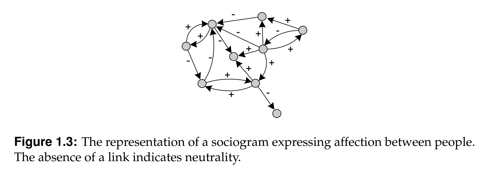 

## Chapter 2: Foundations

### 2.1 Formalities

<u>**Definition 2.1**</u>: A <u>graph</u> $G$ consists of a collection $V$ of <u>vertices</u> and a collection $E$ of <u>edges</u>, which we write $G = (V,E)$. Each edge $e \in E$ is said to join two vertices, which are called its <u>end points</u>. If $e$ joins $u,v \in V$, we write $e = \langle u,v \rangle$. Vertices $u$ and $v$ are said to be <u>adjacent</u>. Edge $e$ is said to be <u>incident</u> with vertices $u$ and $v$, respectively.

**Special cases**:
- **Simple graphs**: do not have loops (an edge linking a node to itself) or multiple edges between two nodes.
- **Empty graph**: trivial graph, with no nodes and consequently no edges.
-  **Complete graph** (denoted $K_n$): a simple graph with $n$ nodes, with each node being connected to all other nodes.
- **Complement of a graph** $G$ (denoted $\overline G$): obtained from $G$ by removing all its edges and joining the vertices that were *not* adjacent.

<u>**Definition 2.2**</u>: For any graph $G$ and vertex $v \in V(G)$, the <u>neighbor set</u> $N(v)$ is the set of vertices (other than $v$) adjacent to $v$, that is:

$$
N(v) \stackrel{\text{def}}{=} \{ w \in V(G)\ |\ v \neq w, \exists\ e \in E(G) : e = \langle u,v \rangle \}.
$$

 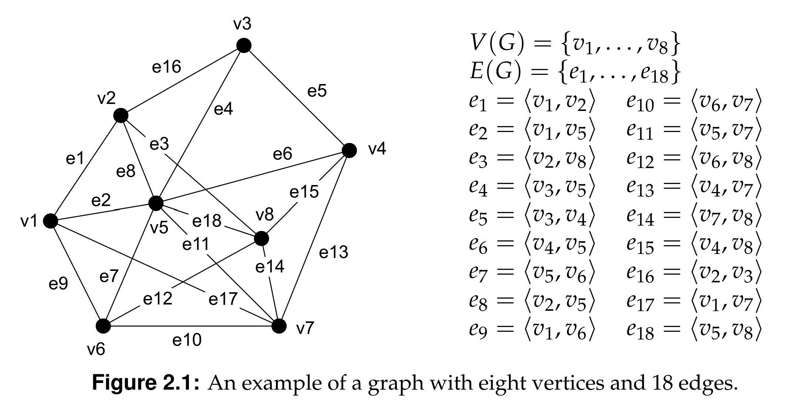 

**Degree of a vertex**: number of edges that are incident with it.

<u>**Definition 2.3**</u>: The number of edges incident with a vertex $v$ is called the *degree* of $v$, denoted as $\delta (v)$. Loops are counted twice.

<u>**Theorem 2.1**</u>: For all graphs $G$, the sum of vertex degrees is twice the number of edges, that is:

$$
\displaystyle\sum_{v \in V(G)} \delta(v) = 2 \cdot |E(G)|.
$$

<u>**Proof**</u>: When we count the edges of a graph G by enumerating for each vertex v of G the edges incident with that vertex v, we are counting each edge exactly twice.

<u>**Corollary 2.1**</u>: For any graph, the number of vertices with odd degree is even.
- Let us split all vertices into two sets ($V_\text{odd}$ and $V_\text{even}$), based on whether the vertices have odd or even degree.
- We know that
    - $\sum_{v \in V} \delta(v)$ is even (Theorem 2.1);
    - $\sum_{v \in V} \delta(v) = \sum_{v \in V_\text{odd}} \delta(v) + \sum_{v \in V_\text{even}} \delta(v)$;
    - $\sum_{v \in V_\text{even}} \delta(v)$ is even;
- Thus, $\sum_{v \in V_\text{odd}} \delta(v)$ must add up to an even number, which means that the number of nodes with odd degree is even.

**Degree sequence**: list of degrees of all vertices in a graph.
- If every vertex in a graph has the same degree, the graph is called *regular*.
- A $k$-regular graph is one in which all vertices have degree $k$. Cubic graphs are a special case in which $k=3$.

<u>**Theorem 2.2**</u> ([Havel-Hakimi](https://en.wikipedia.org/wiki/Havel%E2%80%93Hakimi_algorithm)): Consider a list $\mathbf{s} = [d_1, d_2, ..., d_n]$ of $n$ numbers in descending order. This list is graphic if and only if $\mathbf{s}^{\ast} = [d^\ast_1, d^\ast_2, ..., d^\ast_{n-1}]$ of $n-1$ numbers is graphic as well, where:

$$
d^\ast_{i} = \begin{cases}
    d_{i+1} - 1, & \text{for } i=1,2, ..., d_1 \\
    d_{i+1}, & \text{otherwise}
\end{cases}
$$

<u>**Definition 2.4**</u>: A graph $H$ is a *subgraph* of $G$ if $V(H) \subseteq V(G)$ and $E(H) \subseteq E(G)$ such that for all $e \in E(H)$ with $e = \langle u,v \rangle$, we have that $u,v \in V(H)$. When $H$ is a subgraph of $G$, we write $H \subseteq G$.

<u>**Definition 2.5**</u>: Consider a graph $G$ and a subset $V^\ast \subseteq V(G)$. The *subgraph induced by* $V^\ast$ has vertex set $V^\ast$ and edge set $E^\ast$ defined by:

$$
E^\ast \stackrel{\text{def}}{=} \{ e \in E(G) \mid e = \langle u, v \rangle \text{ with } u,v \in V^\ast \}
$$

Likewise, if $E^\ast \subseteq E(G)$, the subgraph induced by $E^\ast$ has edge set $E^\ast$ and vertex set $V^\ast$ defined by: 

$$
V^\ast \stackrel{\text{def}}{=} \{ u,v \in V(G)\ |\ \exists\ e \in E^\ast : e = \langle u,v \rangle \}
$$

The subgraph induced by $V^\ast$ or $E^\ast$ is written as $G[V^\ast]$ or $G[E^\ast]$, respectively.

- Every graph $G = (V, E)$ having $n$ vertices can be seen as a subgraph of the complete graph $K_n$.
- Considering the complement $\overline G = (V, \overline E)$, then the *union* $G \cup \overline G$ (the graph with vertex set $V$ and edge set $E \cup \overline E$) corresponds to $K_n$.

<u>**Definition 2.6**</u>: Consider a simple graph $G=(V,E)$. The *line graph* of $G$, denoted as $L(G)$ is constructed from $G$ by representing each edge $e = \langle u,v \rangle$ from $E$ by a vertex $v_{e}$ in $L(G)$, and joining two vertices $v_{e}$ and $v_{e^\ast}$ if and only if edges $e$ and $e^\ast$ are incident with the same vertex in $G$.

 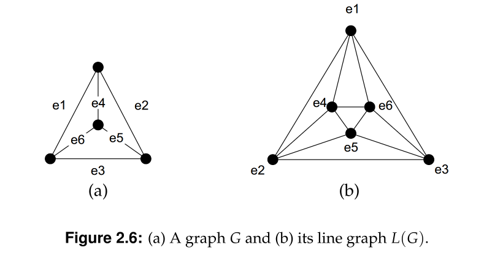 

**Special induced graphs**
- $G - v$ or $G[V(G) \backslash \{v\}]$: induced subgraph generated by removing vertex $v$.
- $G - e$ or $G[E(G) \backslash \{e\}]$: induced subgraph generated by removing edge $e$.

### 2.2 Graph representations

 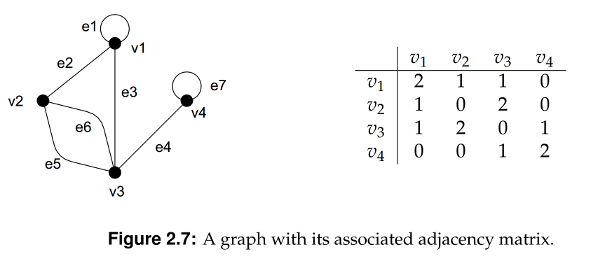 

**Adjacency matrix**
- Consider a graph $G$ with $n$ vertices and $m$ edges.
- Its adjacency matrix $A$ is a table with $n$ rows and $n$ columns (square matrix), so that each entry $\mathbf{A}[i,j]$ denotes the number of edges joining vertices $v_i$ to $v_j$.
- Properties:
    - An adjacency matrix is *symmetric*, that is, for all $i,j$, $\mathbf{A}[i,j] = \mathbf{A}[j,i]$. (This is a consequence of representing edges as unordered pairs of vertices: $e = \langle v_i, v_j \rangle = \langle v_j, v_i \rangle$.)
    - A graph $G$ is simple if and only if for all $i,j$ $\mathbf{A}[i,j] \leq 1, i\neq j$ and $\mathbf{A}[i,i] = 0$ (there is at most one edge joining $v_i$ and $v_j$ and no loops).
    - $\delta(v_i) = \sum^{n}_{j=1} = \mathbf{A}[i,j]$, that is, the sum of row $i$ is equal to the degree of vertex $v_i$.

 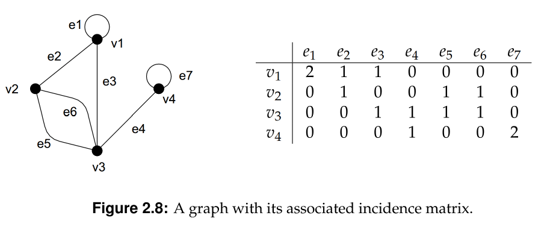 

**Incidence matrix**
- The incidence matrix of a graph $G$ has $n$ rows and $m$ columns (non-square), so that $\mathbf{M}[i,j]$ contains the number of times ($0$, $1$ or $2$) that edge $e_j$ is incident with vertex $v_i$.
- Properties:
    - $G$ has no loops if and only if for all $i,j$ $\mathbf{M}[i,j] \leq 1$.
    - $\forall i: \delta(v_i) = \sum^{m}_{j=1} = \mathbf{M}[i,j]$, that is, the sum of row $i$ is equal to the degree of vertex $v_i$.
    - Since every edge connects two (not necessarily distinct) endpoints, then $\forall j: \sum^{n}_{i=1} \mathbf{M}[i,j] = 2$.

**Edge list**
- More efficient representation in terms of storage.
- It is a list of edges of graph $G$, specifying for each edge which vertices it is incident with.
- Example: $\big( \langle v_1, v_1 \rangle, \langle v_1, v_2 \rangle, \langle v_1, v_3 \rangle, \langle v_2, v_3 \rangle, \langle v_2, v_3 \rangle, \langle v_3, v_4 \rangle, \langle v_4, v_4 \rangle \big)$

<u>**Definition 2.7**</u>: Consider two graphs $G = (V, E)$ and $G^{\ast} = (V^\ast, E^\ast)$. $G$ and $G^\ast$ are *isomorphic* if there exists a one-to-one mapping $\phi : V \rightarrow V^\ast$ such that for every edge $e \in E$ with $e = \langle u,v \rangle$, there is a unique edge $e^\ast \in E^\ast$ with $e^\ast = \langle \phi(u), \phi(v) \rangle$.
> "Stated differently, two graphs $G$ and $G^\ast$ are isomorphic if we can <u>uniquely</u> map the vertices and edges of $G$ to those of $G^\ast$ such that if two vertices were joined in $G$ by a number of edges, their counterparts in $G^\ast$ will be joined by the same number of edges." (p. 33)

<u>**Theorem 2.3**</u>: If two graphs $G$ and $G^\ast$ are isomorphic, then their respective ordered degree sequences should be the same.
- This is a <u>necessary</u> condition for isomorphism, but not a <u>sufficient</u> one.
- There are no known easy <u>sufficient</u> conditions to tell whether two graphs are isomorphic or not: once all necessary conditions are met, we have to resort to trial and error.
    - In the worst case, there are potentially $n!$ mappings to check!

### 2.3 Connectivity

<u>**Definition 2.8**</u>: Consider a graph $G$. A $\mathbf{(v_0, v_k)}$-**walk** in $G$ is an alternating sequence $[v_0, e_1, v_1, e_2, ..., v_{k-1}, e_k, v_k]$ of vertices and edges from $G$ with $e_i = \langle v_{i-1}, v_i\rangle$. In a **closed walk**, $v_0 = v_k$. A **trail** is a walk in which all edges are distinct; a **path** is a trail in which also all vertices are distinct. A **cycle** is a closed trail in which all vertices  except $v_0$ and $v_k$ are distinct.

<u>**Definition 2.9**</u>: Two distinct vertices $u$ and $v$ in graph $G$ are *connected* if there exists a $(u,v)$-path in $G$. $G$ is *connected* if all pairs of distinct vertices are connected.

<u>**Definition 2.10**</u>: A subgraph $H$ of $G$ is called a *component* of $G$ if $H$ is connected and not contained in a connected subgraph of $G$ with more vertices or edges. The number of components of $G$ is denoted by $\omega (G)$.
- A component is the *maximal, connected* subgraph.

<u>**Definition 2.11**</u>: For a graph $G$ let $V^\ast \subset V(G)$ and $E^\ast \subset E(G)$. $V^\ast$ is called a *vertex cut* if $\omega(G - V^\ast) > \omega(G)$. If $V^\ast$ consists of a single vertex $v$, then $v$ is called a *cut vertex*. Likewise, if $\omega(G - E^\ast) > \omega(G)$ then $E^\ast$ is called an *edge cut*. If $E^\ast$ consists of only a single edge $e$, then $e$ is known as a *cut edge*.

**Minimal vertex cut of a connected graph**
- How many vertices do we need to remove from a connected graph before it becomes disconnected.
- Let $\kappa(G)$ denote the minimal vertex cut for $G$ and $\lambda(G)$, the minimal edge cut for $G$.
- $\kappa(G)$ is less than or equal to $\lambda(G)$, $\lambda(G)$ is less or equal to the minimal vertex degree.

<u>**Theorem 2.4**</u>: $\kappa(G) \leq \lambda (G) \leq \min\{\delta(v) \mid v \in V(G)\}$

- $\mathbf{k}$-**connected**: graph $G$ for which $\kappa(G) \geq k$.
- $\mathbf{k}$-**edge-connected**: graph $G$ for which $\lambda(G)\geq k$.
- **Optimally connected**: graph $G$ for which $\kappa(G) = \lambda (G) = \min\{\delta(v) \mid v \in V(G)\}$.

<u>**Definition 2.12**</u>: Consider a graph $G$ and a collection $\mathbf{P}$ of $(u,v)$-paths in $G$, with $u,v \in V(G)$. $\mathbf{P}$ is *vertex independent* if for all $(u,v)$-paths $P_1, P_2 \in \mathbf{P}$ we have that $V(P_1) \cap V(P_2) = \{u,v\}$. The collection is *edge independent* if for all its $(u,v)$-paths $P_1$ and $P_2$, we have that $E(P_1) \cap E(P_2) = \varnothing$. 
- In other words, two $(u,v)$-paths $P_1$ and $P_2$ are *vertex independent* if they do not share any other vertices apart from $u$ and $v$, and they are *edge independent* if they share no edge.

<u>**Theorem 2.5**</u> ([Menger](https://en.wikipedia.org/wiki/Menger%27s_theorem)): Let $G$ be a connected graph and $u$ and $v$ two nonadjacent vertices in $G$. The minimum number of vertices in a vertex cut that disconnects $u$ and $v$ is equal to the maximum number of pairwise vertex-independent path between $u$ to $v$. Analogously, the minimum number of edges in an edge cut that disconnects $u$ and $v$, is equal to the maximum number of pairwise edge-independent paths between $u$ and $v$.

<u>**Corollary 2.2**</u>: A graph $G$ is $k$-connected if and only if any two distinct vertices are connected by at least $k$ pairwise vertex-independent paths. $G$ is $k$-edge-connected if and only if  any two distinct vertices are connected by at least $k$ pairwise edge-independent paths.

<u>**Corollary 2.3**</u>: Each edge of a $2$-edge-connected graph lies on a cycle.

For any simple graph $G$ a higher value of $\kappa(G)$ (size of a minimal vertex cut) implies more edges are needed.
- In every $k$-connected graph each vertex will have at least $k$ incident edges.
- Given that $\sum \delta (v) = 2 \cdot m$ (the sum of vertex degrees is twice the number of edges), for a graph with $n$ vertices, we would need $\frac{1}{2}\sum\delta (v)$ and thus at least $\frac{1}{2}\sum k = \frac{1}{2} n \cdot k$ edges.
- What is the minimal number of edges for a graph to be $k$-connected?

<u>**Definition 2.13**</u>: A *Harary graph* $\mathbf{H}_{k,n}$ is a $k$-connected simple graph with a minimal number of edges.
- $\mathbf{H}_{k,n}$ has exactly $[k \cdot \frac{n}{2}]$ edges.

<u>**Theorem 2.6**</u>: The Harary graph $\mathbf{H}_{k,n}$ is $k$-connected.

**A Harary graph has a minimal number of edges**
- For any $k$-connected graph, each vertex has degree $\delta(v) \geq k$.
- Let $m_k(n)$ be the minimal number of edges for any simple $k$-connected graph $G$.
- Since $|E(G)| = \frac{1}{2}\sum_{v \in V(G)} \delta(v) \geq \frac{1}{2}\sum_{v \in V(G)} \delta_{min} \geq \frac{n \cdot k}{2}$, we know that $m_k(n) \geq \frac{n \cdot k}{2}$.
- It is not difficult to verify that $|E(\mathbf{H}_{k,n})| = \frac{nk}{2}$ (a Harary graph has minimal number of edges).

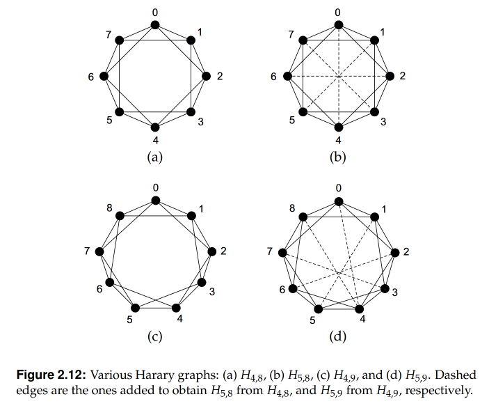

### 2.4 Drawing graphs

#### Graph embeddings
"[A] representation of a graph on a surface where vertices are associated with points on that surface".

**Circular embedding**: vertices are placed at evenly spaced points on a circle.
- Advantage: no three vertices are ever collinear; each edge is visible and can be drawn as a straight line.

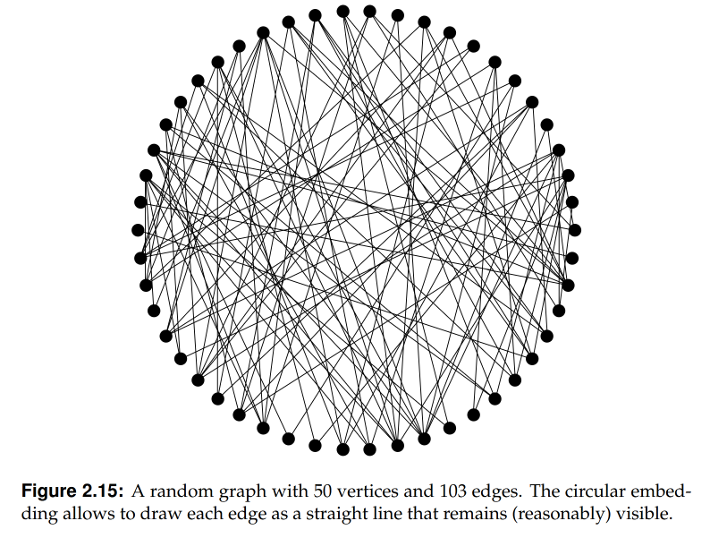

<u>**Definition 2.14**</u>: A graph $G$ is *bipartite* if $V(G)$ can be partitioned into two disjoint subsets $V_1$ and $V_2$ such that each edge $e \in E(G)$ has one endpoints in $V_1$ and the other in $V_2$, that is $E(G) \subseteq \{e = \langle u_1, u_2\rangle \mid u_1 \in V_1, u_2 \in V_2\}$.
- Sometimes, bipartite graphs are conveniently drawn as *ranked embeddings*.

**Ranked embeddings**: vertices are ranked according to their distance to a $v$.

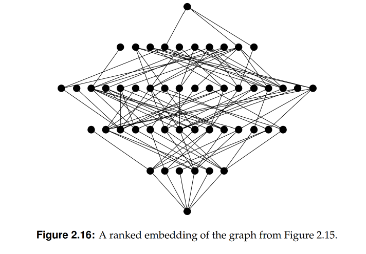

**Spring embeddings**: vertices are modeled as springs connected by springs.
- This is essentially a computational approach.
- Main reference: [Eades (1984)](https://www.cs.ubc.ca/~will/536E/papers/Eades1984.pdf).

Logic:
- Each vertex $u$ is initially positioned at $(u_x, u_y)$.
- Each spring $e = \langle u,v \rangle$ exerts an attracting force $F_{att}(u,v)$ on vertices $u$ and $v$, such that:

$$
F_{att}(u,v) \stackrel{\text{def}}{=}
\begin{cases}
2\log\big(d(u,v)\big), & \text{if adjacent} \\
0, & \text{otherwise}
\end{cases} 
$$

where

$$
d_{u,v} \stackrel{\text{def}}{=} \sqrt{(u_x - v_x)^2 + (u_y - v_y)^2}
$$

is the length of the spring.

- Each pair of nonadjacent vertices are subject to a repelling force $F_{rep}(u,v)$, such that:

$$
F_{rep}(u,v) \stackrel{\text{def}}{=}
\begin{cases}
0, & \text{if adjacent} \\
1/\sqrt{d(u,v)}, & \text{otherwise}
\end{cases}
$$

<u>**Algorithm 2.1**</u> (Spring embedding):

1. Place the vertices at random locations;
2. For each vertex $u$, calculate the resulting forces in the $x$ and $y$ directions, respectively:
    - $F_x(u) \stackrel{\text{def}}{=} \sum_{v \neq u} F_{att, x}(u,v) - F_{rep,x}(u,v)$
    - $F_y(u) \stackrel{\text{def}}{=} \sum_{v \neq u} F_{att, y}(u,v) - F_{rep,y}(u,v)$
3. Reposition vertex $u$ according to: 
    - $u_x \leftarrow u_x + 0.1 \cdot F_x(u)$
    - $u_y \leftarrow u_y + 0.1 \cdot F_y(u)$
4. Goto Step 2. Stop after $M$ iterations.

The attracting force *in the* $x$ *direction* $F_{att, x}(u,v)$ is given by 

$$
F_{att, x}(u,v) \stackrel{\text{def}}{=} F_{att}(u,v) \cdot \displaystyle\frac{|v_x - u_x|}{d(u,v)}
$$

The definitions of $F_{att, y}(u,v)$, $F_{rep, x}(u,v)$ and $F_{rep, y}(u,v)$ are analogous.

#### Planar graphs

<u>**Definition 2.15**</u>: A *plane graph* is a specific embedding of a graph $G$ such that no edges intersect. If such an embedding exists, $G$ is said to be planar.
- *Regions* (or faces): portions enclosed by the edges of the graph.

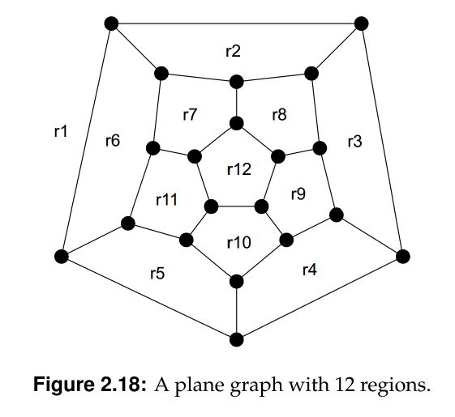

<u>**Theorem 2.7**</u> ([Euler's formula](https://en.wikipedia.org/wiki/Planar_graph#Euler's_formula)): For a plane graph $G$ with $n$ vertices, $m$ edges, and $r$ regions, we have that $n - m + r = 2$.

<u>**Definition 2.16**</u>: A simple, connected graph with no cycles is called a *tree*. A simple graph having only trees as its components is called a *forest*.

<u>**[Lemma](https://en.wikipedia.org/wiki/Lemma_(mathematics)) 2.1**</u>: Any tree $T$ with $n$ vertices has $|E(T)| = n - 1$ edges.

<u>**Theorem 2.8**</u> ([Principle of induction](https://en.wikipedia.org/wiki/Mathematical_induction)): Let $S(n)$ be a mathematical statement formulated in terms of a natural number $n$. $S(n)$ is true if the following two statements are true:
1. $S(1)$ is true;
2. for any $k \in \mathbb{N}$, if $S(k)$ is true, then $S(k+1)$ is true.

<u>**Theorem 2.9**</u>: For any connected simple planar graph $G$ with $n \geq 3$ vertices and $m$ edges, we have that $m \leq 3n-6$.
- This theorem is a *necessary* condition for a simple graph to be planar.
- This theorem can be used to prove that $K_5$ (complete graph with 5 vertices) cannot be planar.

<u>**Corollary 2.4**</u>: The complete graph on 5 vertices, $K_5$ is nonplanar.

<u>**Theorem 2.10**</u>: The complete bipartite graph $K_{3,3}$ is nonplanar.

<u>**Corollary 2.5**</u>: Any connected, simple graph having a subgraph isomorphic to either $K_5$ or $K_{3,3}$ cannot be planar.

## Chapter 3: Extensions

### 3.1 Directed graphs

<u>**Definition 3.1**</u>: A *directed graph* or *digraph* $D$ consists of a collection of *vertices* $V$, a collection of *arcs* $A$, for which we write $D = (V, A)$, Each arc $a = \langle  \overrightarrow{u,v} \rangle$ is said to join vertex $u \in V$ (called *tail*) to another (not necessarily distinct) vertex $v$ (called *head*).
- The *underlying graph* $G(D)$ of a digraph $D$ is obtained by replacing each arc $a = \langle  \overrightarrow{u,v} \rangle$ with its undirected counterpart.
- An undirected graph $G$ can be transformed into a digraph $D(G)$ by associating a direction with each edge. Such a digraph is known as *orientation*.

<u>**Definition 3.2**</u>: Consider a digraph $D$ and vertex $v \in V(D)$. The *in-neighbor set* $N_{in}(v)$ consists of the adjacent vertices having an arc with $v$ as its head. Likewise, the *out-neighbor set* $N_{out}(v)$ consists of the adjacent vertices having an arc with $v$ as its tail. Formally,

$$
\begin{array}{ll}
N_{in}(v) \stackrel{\text{def}}{=} \{ w \in D \mid v \neq w , \exists a = \langle  \overrightarrow{w,v} \rangle : a \in A(D) \} \\
N_{out}(v) \stackrel{\text{def}}{=} \{ w \in D \mid v \neq w , \exists a = \langle  \overrightarrow{v,w} \rangle : a \in A(D) \}
\end{array}
$$

- The set of neighbors $N(v)$ is simply the union: 

$$
N(v) \stackrel{\text{def}}{=} N_{in}(v) \cup N_{out}(v)
$$

**Strict digraph**: has no loops and no two arcs with the same end points have the same orientation.
- Analogous to the simple (undirected) graph.

<u>**Definition 3.3**</u>: For a vertex $v \in V(D)$, the number of arcs with head $v$ is called the *in-degree* $\delta_{in}(v)$. Likewise, the *out-degree* $\delta_{out}(v)$ is the number of arcs having $v$ as tail.

<u>**Theorem 3.1**</u>: For any directed graph $D$ the sum of in-degrees as well as the sum of out-degrees is equal to the total number of arcs:

$$
\displaystyle\sum_{v \in V(D)} \delta_{in}(v) = \displaystyle\sum_{v \in V(D)} \delta_{out}(v) = |A(D)|
$$

**Adjacency matrix**: matrix $\mathbf{A}$ in which $\mathbf{A}[i,j]$ is equal to the number of arcs joining vertex $v_i$ to $v_j$.
- $D$ is strict iff $\forall i, j : \mathbf{A}[i,j] \leq 1, \mathbf{A}[i,i] = 0$.
- For each vertex $v_i$, $\sum_{j} \mathbf{A}[i,j] = \delta_{out}(v_i)$ and $\sum_{j} \mathbf{A}[j,i] = \delta_{in}(v_i)$.
- For a digraph, the adjacency matrix is not necessarily symmetric.

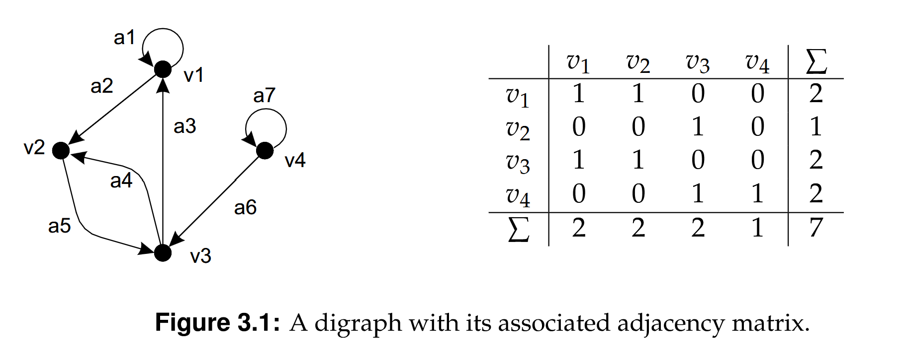

**Incidence matrix**: matrix $\mathbf{M}$ in which $\mathbf{M}[i,j]$ whether vertex $v_i$ is incident to arc $a_j$, so that:

$$
\mathbf{M}[i,j] = 
\begin{cases}
1, & \text{if }v_i\text{ is the tail of }a_j \\
-1, & \text{if }v_i\text{ is the head of }a_j \\
0, & \text{otherwise}
\end{cases}
$$

- This representation will not work if the digraph has loops.

<u>**Definition 3.4**</u>: For a digraph $D$, a *directed* $\mathit{(v_0, v_k)}$-*walk* in $D$ is an alternating sequence $[v_0, a_0, v_1, a_1, ... v_{k-1}, a_{k-1}, v_k]$ of vertices and arcs from $D$ with $a_{i} = \langle \overrightarrow{v_i, v_{i+1}}\rangle$. A *directed trail* is a directed walk in which all arcs are distinct; a *directed path* is a directed trail in which all vertices are also distinct. A *directed cycle* is a directed trail in which all vertices ar distinct except for $v_0$ and $v_k$.

<u>**Definition 3.5**</u>: A digraph $D$ is *strongly connected* if there exists a directed path between every pair of distinct vertices from $D$. A digraph is *weakly connected* if its underlying graph (i.e., its undirected counterpart) is connected.

<u>**Algorithm 3.1**</u> (Reachable vertices): Let $R_0(u)$ denote the set of reachable vertices from $u$ found after $t$ steps.

1. Set $t \leftarrow 0$ and $R_0(u) \leftarrow \{u\}$
2. Construct the set $R_{t+1}(u) \leftarrow R_t(u) \cup_{v \in R_t(u)} N_{out}(v)$
3. If $R_{t+1}(u) = R_t(u)$, stop: $R(u) \leftarrow R_t(u)$. Otherwise, increment $t$ and repeat the previous step.

- This is an example of [**breadth-first algorithm**](https://www.geeksforgeeks.org/dsa/breadth-first-search-or-bfs-for-a-graph/).
- $D$ will be strongly connected iff $\forall u \in V(D): R(u) = V(D)$

 

**Question**: Can we provide an orientation for a given (connected) undirected graph such that the resulting digraph is strongly connected?

<u>**Theorem 3.2**</u> ([Robbins' theorem](https://en.wikipedia.org/wiki/Robbins%27_theorem)): There exists an orientation $D(G)$ for a connected undirected graph $G$ that is strongly connected iff $\lambda (G) \geq 2$ (i.e., $G$ cannot be $1$-edge-connected).

### 3.2 Weighted graphs

<u>**Definition 3.6**</u>: A *weighted graph* $G$ is a graph for which each edge $e$ has an associated real-valued number $w(e)$ called its *weight*. For any subgraph $H \subseteq G$, the weight of $H$ is simply the sum of the weights of its edges: $w(H) = \sum_{e \in E(H)} w(e)$.
- Conventions: $w(\langle u,v\rangle) = \infty$, when $u$ and $v$ are not adjacent; thus, for each edge $e \in E(G)$, $w(e) < \infty$

<u>**Definition 3.7**</u>: Consider an undirected graph $G$ and two vertices $u, v \in V(G)$. Let $P$ be a $(u,v)$-path having minimal weight among all $(u,v)$-paths in $G$. The weight of $P$ is known as the *(geodesic) distance* $d(u,v)$ between $u$ and $v$. Path $P$ is called a *shortest path* $(u,v)$-path, or a *geodesic* between $u$ and $v$.

**Dijkstra's algorithm**
- Efficient algorithm for finding the shortest path from a vertex $u$ to all other vertices in a given undirected graph.
- Another example of breadth-first algorithm.
- Creates a tree rooted at $u$: $T(u)$.

<u>**Algorithm 3.2**</u> ([Dijkstra's algorithm](https://en.wikipedia.org/wiki/Dijkstra%27s_algorithm)): Consider an undirected, simple weighted graph $G$, <u>whose weights are nonnegative</u>, and a vertex $u \in V(G)$.
- Let $S_t(u)$ be the set of vertices to which a shortest path from $u$ has been found after step $t$.
- Each vertex $v$ is assigned a label $\mathbf{L}(v) \stackrel{\text{def}}{=} \big(L_1(v), L_2(v)\big)$, in which $L_1(v)$ is the vertex preceeding $v$ in the shortest $(u,v)$-path found so far, and $L_2(v)$ the total weight of that path.
- Let $R_t(u) \stackrel{\text{def}}{=} S_t(u) \cup_{v \in S_t(u)} N(v)$, with $N(v)$ denoting the neighbor set of $v$ (i.e., $R_t(u)$ consists of all vertices in $S_t(u)$ and their neighbors).

**Algorithm**:

1. Initialize $t \leftarrow 0$ and $S_0(u) \leftarrow \{u\}$. Furthermore, for all $v \in V(G)$:

$$
\mathbf{L}(v) =
\begin{cases}
(u, 0) & \text{if } v=u \\
(-, \infty) & \text{otherwise}
\end{cases}
$$

2. For each vertex $y \in R_t(u) \setminus S_t(u)$, consider the vertices $N^{\prime}(y)$ that are neighbors of $y$ that lie in $S_t(u)$, i.e., $N^{\prime}(y) \stackrel{\text{def}}{=} N(y) \cap S_t(u)$. Select $x \in N^{\prime}(y)$ for which $L_2(x) + w(\langle x,y\rangle)$ is minimal. Set $\mathbf{L}(y) \leftarrow \big(x, L_2(x) + w(e)\big)$
3. Let $z \in R_t(u) \setminus S_t(u)$ for which $L_2(z)$ is minimal. Set $S_{t+1}(u) \leftarrow S_t(u) \cup \{z\}$. If $S_{t+1} = V(G)$, stop. Otherwise, $t \leftarrow t+1$, compute $R_t(u)$ again and repeat the previous step.

**Pseudocode**:

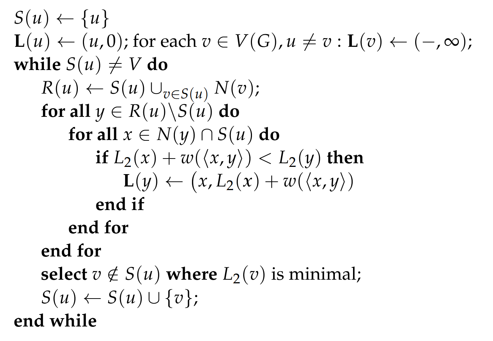

### 3.3 Colorings

#### Edge coloring

Assigning colors such that edges incident  with the same vertex have different colors.

<u>**Definition 3.8**</u>: Consider a connected, loopless graph $G$. $G$ is $k$-*edge-colorable* if there exists a partitioning of $E(G)$ into $k$ disjoint sets $E_1, ..., E_k$ such that no two edges from the same $E_i$ are incident with the same vertex.
- A partitioning of a set is formally defined as a collection of sets $S_1, ..., S_k$ such that:
    - $\forall i: S_i \subseteq S$
    - $\cup_{i=1}^{k} S_i = S$
    - $\forall i \neq j: S_i \cap S_j = \varnothing$

**Edge chromatic number**: minimal $k$ for which $G$ is $k$-edge-colorable.
- Denoted by $\chi'(G)$.
- If $\Delta(G)$ is the maximal degree of a vertex in graph $G$, i is obvious that $\chi'(G) \geq \Delta(G)$.

<u>**Theorem 3.3**</u> ([Vizing's theorem](https://en.wikipedia.org/wiki/Vizing%27s_theorem)): For any simple graph $G$, either $\chi'(G) = \Delta(G)$ or $\chi'(G) = \Delta(G) + 1$.

#### Vertex colorings

<u>**Definition 3.9**</u>: Consider a simple connected graph $G$. $G$ is $k$-*vertex-colorable* if there exists a partitioning of $V(G)$ into $k$ disjoint set $V_1, ..., V_k$ such that no two vertices from the same $V_i$ are adjacent.
- $\forall V_i, \forall x, y \in V_i : \nexists e \in E(G): e = \langle x, y \rangle$

**Chromatic number** of $G$: minimal $k$ for which $G$ is $k$-vertex-colorable.
- Denoted by $\chi(G)$.

<u>**Theorem 3.4**</u>: The minimum number of time slots needed for the class-scheduling problem is the value of $\chi(G)$.

<u>**Theorem 3.5**</u>: For any (simple, connected) graph $G$, $\chi(G) \leq \Delta(G) + 1$.

<u>**Theorem 3.6**</u>: For any planar graph $G$, $\chi(G) \leq 4$.

<u>**Theorem 3.7**</u>: Every planar graph $G$ has a vertex $v$ with $\delta (v) \leq 5$.

<u>**Theorem 3.8**</u>: For any planar graph $G$, $\chi(G) \leq 5$.

## Chapter 4: Network traversal

### 4.1 Euler tours

<u>**Definition 4.1**</u>: A *tour* of a graph is a $(u,v)$-walk in which $u=v$ (i.e., a closed walk) and that traverses each edge in $G$.An *Euler tour* is a tour in which all edges are traversed exactly once.

<u>**Theorem 4.1**</u>: A connected graph $G$ (with $n > 1$) has an Euler tour iff it has no vertices of odd degree.

<u>**Theorem 4.2**</u>: A connected graph $G$ (with $n > 1$) has an Euler trail iff it has two vertices of odd degree. Moreover, the trail originates and ends in the vertices of odd degree.

<u>**Algorithm 4.1**</u> ([Fleury](https://en.wikipedia.org/wiki/Eulerian_path#Fleury's_algorithm)): Consider an Eulerian graph $G$.

1. Choose an arbitrary vertex $v_0 \in V(G)$ and set $W_0 = v_0$.
2. Assume that we have constructed a trail $W_k = [v_0, e_1, ..., e_k, v_k]$.
    - Choose an edge incident to $v_k$, but which is not yet part of $W_k$, that is, $e_{k+1} = \langle v_k, v_{k+1}\rangle$ and $e_{k+1} \in E(G) \setminus E(W_k)$.
    - In addition, make sure that $e_{k+1}$ is not a cut edge of the induced subgraph $G_k = G - E(W_k)$, unless there is no other option.
3. We now have a trail $W_{k+1}$. If there is no edge $e_{k+2} = \langle v_{k+1}, v_{k+2}\rangle$ to select from $E(G) \setminus E(W_{k+1})$, stop. Otherwise, repeat the previous step.

<u>**Theorem 4.3**</u>: A trail constructed by Fleury's algorithm in an Eulerian graph is an Euler tour of $G$.

**[The Chinese postman problem](https://en.wikipedia.org/wiki/Chinese_postman_problem)**: Consider a weighted graph $G$ in which each edge has a nonnegative weight.
- The problem is to find a closed walk $W = [v_0, e_1, v_1, ..., e_n, v_n]$ that covers all edges of $G$, but with minimal weight.
- In other words, $E(W) = E(G)$ and $\sum_{i=1}^{n} = w(e_i)$ is minimal.
- Related traversal problems:
    - *Routing garbage trucks*: neighborhood is an undirected graph, each junction is a vertex and each street is an edge (whose weight is interpreted as the length of the street).
    - *Routing a postman*: In this a junction is still a vertex, but a street with houses in both sides is represented by two edges.
    - *Checking a Web site*: Web site is an undirected graph, where a page is a vertex and a link is an edge of weight $1$.
- To solve it, we transform an non-Eulerian graph int an Eulerian one by *duplicating* edges.
    - Duplicating an edge $e = \langle u,v\rangle$ means adding an edge $e^{\ast} = \langle u,v\rangle$ with the same weight as $e$.
    - The trick is to duplicate as few edges as possible, so that the total weight of the resulting graph is minimal.
    - Once we have transformed the graph into an Eulerian one, we apply Fleury's algorithm to find an Euler tour.
        - By ensuring that the weight of the transformed graph is minimal, we also ensure that the Euler tour is minimal.
    - Unfortunately, transforming a graph to a Eulerian one that has as less weight as possible is not trivial.

<u>**Algorithm 4.2**</u>: Consider a weighted, connected graph $G$ with odd-degree vertices $V_{odd}= \{v_1, ..., v_{2k}\}$ where $k \geq 1$.

1. For each pair of distinct odd-degree vertices $v_i$ and $v_j$, find a minimum weight $(v_i, v_j)$-path $P_{i,j}$. 
2. Construct a weighted complete graph on $2k$ vertices in which vertex $v_i$ and $v_j$ are joined by an edge having weight $w(P_{i,j})$.
3. Find the set $E$ of $k$ edges $e_1, ..., e_k$ such that $\sum w(e_i)$ is minimal and no two edges are incident with the same vertex.
4. For each edge $e \in E$, with $e = \langle v_i, v_j \rangle$, duplicate the edges of $P_{i,j}$ in graph $G$.

The resulting graph $G^{\ast}$ is Eulerian with minimal weight, for which we then apply Fleury's algorithm to find a minimum-weight Euler tour.

### 4.2 Hamilton cycles

<u>**Definition 4.2**</u>: Consider a connected graph $G$. A *Hamilton path* of $G$ is a path that contains every vertex of $G$. Likewise, a *Hamilton cycle* is a cycle containing every vertex of $G$. $G$ is called *Hamiltonian* if it has a Hamilton cycle.

**Representative problems** (instances of the [Travelling Salesman Problem](https://en.wikipedia.org/wiki/Travelling_salesman_problem)):
- *Transportation problems*: picking up people at $n$ locations with roads as weighted edges between them. The solution is a minimal weighted Hamiltonian subgraph containing all vertices.
- *Drilling holes*: minimize the distance a machine needs to run to drill holes in a board. This can be modeled as a complete graph with vertices as holes and edges' weights being the geometric distance between them.

<u>**Theorem 4.4**</u>: If a graph is Hamiltonian, then for every proper nonempty subset $S \subset V(G)$, we have that $\omega(G-S) \leq |S|$.
- Necessary condition for a graph to be Hamiltonian.

<u>**Theorem 4.5**</u> ([Dirac's theorem](https://en.wikipedia.org/wiki/Dirac%27s_theorem)): If $G$ is a simple graph with $n = |V(G)|$ vertices, $n \geq 3$ and each vertex $v$ has degree $\delta(v) \geq \frac{n}{2}$, then $G$ is Hamiltonian. 
- Sufficient condition for a graph to be Hamiltonian.

<u>**Theorem 4.6**</u> [Ore's theorem](https://en.wikipedia.org/wiki/Ore%27s_theorem): Let $G$ be a simple graph with $n$ vertices. If $u$ and $v$ are distinct, nonadjacent vertices $\delta(u) + \delta(v) \geq n$, then $G$ is Hamiltonian iff $G + \langle u,v \rangle$ is Hamiltonian.

<u>**Definition 4.3**</u>: Consider a graph $G$ with $n$ vertices. The *closure* of $G$ is obtained by iteratively joining each nonadjacent pair of vertices $u$ and $v$ for which $\delta(u) + \delta(v) \geq n$, until no such pairs exist anymore.

<u>**Theorem 4.7**</u> ([Bondy-Chvátal theorem](https://en.wikipedia.org/wiki/Hamiltonian_path#Bondy%E2%80%93Chv%C3%A1tal_theorem)): A simple graph $G$ with $n$ vertices is Hamiltonian iff if its closure is Hamiltonian.

<u>**Algorithm 4.3**</u> ([Pósa's algorithm](https://en.wikipedia.org/wiki/P%C3%B3sa%27s_theorem)): Consider a graph $G$ and let $u \in V(G)$ be a randomly selected vertex. This vertex forms the first vertex of a path $P$ that is expanded as follows. Let $\text{last}(P)$ denote the last vertex of $P$. Note that initially $\text{last}(P) = u$.

1. Randomly select a neighboring vertex $v \in N(\text{last}(P))$, such that (1) preferably, $v$ does not lie on $P$, and (2) if $v \in V(P)$, then $v$ has not been previously selected as neighbor of a last vertex before. If no such vertex exists, stop.
2. If $v \notin V(P)$, set $P \leftarrow P + \langle\text{last}(P), v\rangle$.
3. If $v \in V(P)$ then apply a [rotational transformation](https://mathworld.wolfram.com/PosaRotation.html) of $P$ using $\langle \text{last}(P), v\rangle$, leading to a path $P^{\ast}$ with a new last vertex $\text{last}(P^{\ast})$. If $\text{last}(P^{\ast})$ has not yet been the last vertex for paths of the current length, set $P \leftarrow P^{\ast}$.
4. If in the possibly modified version of $P$ we now have that $V(P) = V(G)$, check if $\langle u, \text{last}(P)\rangle \in E(G)$. If so, we have found a Hamilton cycle. Otherwise, continue with step 1.

<u>**Theorem 4.8**</u>: A directed graph $D$ is Hamiltonian iff its [transformed undirected version](https://www.youtube.com/watch?v=kl2k_wgYYic) $\hat{D}$ is Hamiltonian.

## Chapter 5: Trees

### 5.1 Background

**Trees in transportation networks**
- Boils down to minimizing transportation costs from a source to multiple destinations (i.e., the cheapest path in a network).
- *Connector problem*: setting up a communication infrastructure between a collection of nodes but such that the total costs are minimized.

**Trees as data structures**
- *Rooted trees*: trees with a single vertex designated as root.
- Example of using trees to represent data: consider the expression:

$$
x = \displaystyle\frac{-b + \sqrt{b^2-4ac}}{2a}
$$

- *Leaf nodes* should contain variables and constants; *intermediate nodes* represent operations.
    - Look up [Infix notation](https://en.wikipedia.org/wiki/Infix_notation) and [Infix To Prefix Notation](https://www.geeksforgeeks.org/dsa/convert-infix-prefix-notation/). 

 
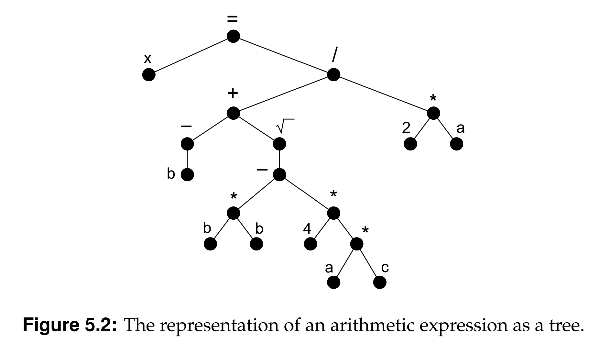
 

- *Binary trees*: special case of rooted trees, in whichh there are exactly two descendants for each intermediate node.

 
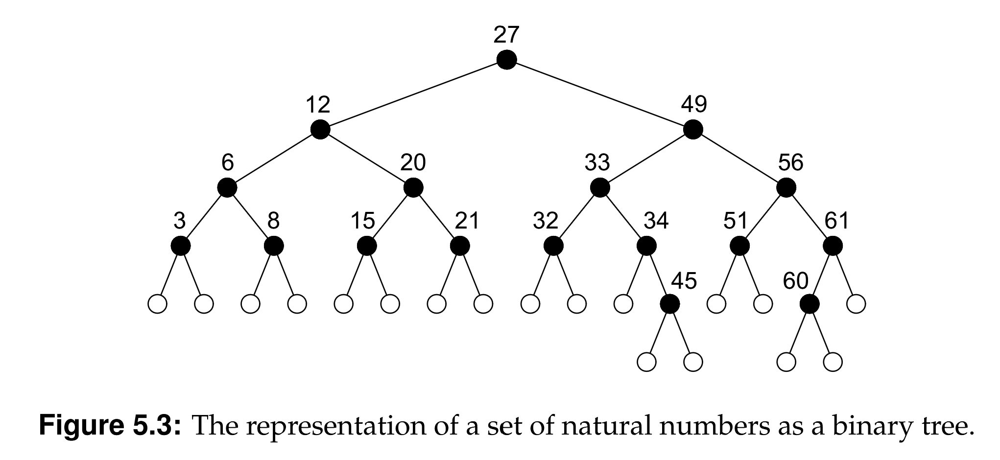
 

### 5.2 Fundamentals

<u>**Theorem 5.1**</u>: For any connected (simple) graph $G$ with $n$ vertices and $m$ edges, $n \leq m + 1$.

<u>**Theorem 5.2**</u>: For any tree $T$ with $n$ vertices and $m$ edges, $n = m+1$.

<u>**Theorem 5.3**</u>: A connected graph $G$ with $n$ vertices and $m$ edges for which $n=m+1$ is a tree.

<u>**Theorem 5.4**</u>: A graph $G$ is a tree iff there exists exactly one path between every two vertices $u$ and $v$.

<u>**Theorem 5.5**</u>: An edge $e$ of a graph $G$ is a cut edge iff $e$ is not part of cycle of $G$.

<u>**Theorem 5.6**</u>: A connected graph $G$ is a tree iff every edge is a cut edge.

### 5.3 Spanning trees

**Spanning tree**: an acyclic connected subgraph containing all vertices.

<u>**Algorithm 5.1**</u> ([Kruskal's algorithm](https://en.wikipedia.org/wiki/Kruskal%27s_algorithm)): Consider a weighted graph $G$ where each edge $e$ has been assigned a real-valued weights $w(e) \in \mathbb{R}$.

1. Suppose that edges $E_k = \{e_1, e_2, ..., e_k\}$ have been chosen so far. Choose a next edge $e_{k+1}$ from  $E(G) \setminus E_k$ such that the following two conditions are met:
    - (1) The induced subgraph $G_{k+1} = G\big[\{ e_1, e_2, ..., e_k\}\big]$ is acyclic.
    - (2) The weight $w(e_{k+1})$ is minimal, i.e., $\forall e \in E(G) \setminus E_k: w(e) \geq w(e_{k+1})$.
2. Stop when there is no more edge to select in the previous step.
    
<u>**Theorem 5.7**</u>: Consider a weighted graph $G$ with $n$ vertices. Any spanning tree $T_{\text{Kruskal}}$ of $G$ constructed by Kruskal's algorithm has minimal weight.

### 5.4 Routing in communication network

> NOTE: A *sink tree* is a tree structure that represents the optimal paths from all nodes to a specific destination node ([source](https://www.tutorialspoint.com/article/sink-tree-in-computer-networks)).

#### Dijkstra's algorithm

<u>**Algorithm 5.2**</u> (Dijkstra's algorithm, sink tree construction): Consider a directed, weighted graph $D$ where weights are nonnegative, and a vertex $u \in V(D)$. We introduce the following sets and labels:
- Let $S_t(u)$ be the set of vertices from which a shortest path to vertex $u$ has been found after step $t$.
- Each vertex $v$ is assigned a label $\mathbf{L}(v) \stackrel{\text{def}}{=} \big(L_1(v), L_2(v)\big)$ in which $L_1(v)$ is the vertex succeeding $v$ in the shortest $(v,u)$-path found so far, and $L_2(v)$ the total weight of the path.
- Let $R_t(u) \stackrel{\text{def}}{=} S_t(u) \cup_{v \in S_t(u)} N_{in}(v)$.

1. Initialize $t \leftarrow 0$ and $S_0(t) \leftarrow \{u\}$. Furthermore, for all $v \in V(G)$:

$$
\mathbf{L}(v) \leftarrow
\begin{cases}
(u, 0) & \text{if } v = u \\
(-, \infty) & \text{otherwise}
\end{cases}
$$

2. For each vertex $y \in R_t(u) \setminus S_t(u)$, consider $N^{\prime}_{out}(y) \stackrel{\text{def}}{=} N_{out}(y) \cap S_t(u)$. Select $x \in N^{\prime}_{out}(y)$ for which $L_2(x) + w(\langle \overrightarrow{y,x} \rangle)$ is minimal. Set $\mathbf{L}(y) \leftarrow (x, L_2(x) + w(e))$.
3. Let $z \in R_t(u) \setminus S_t(u)$ for which $L_2(z)$ is minimal. Set $S_{t+1}(u) \leftarrow S_t(u) \cup \{z\}$. If $S_{t+1}(u) = V(G)$, stop. Otherwise, $t \leftarrow t+1$, compute $R_t(u)$ again and repeat the previous step.

> PAGE 122 (THEOREM 5.8)